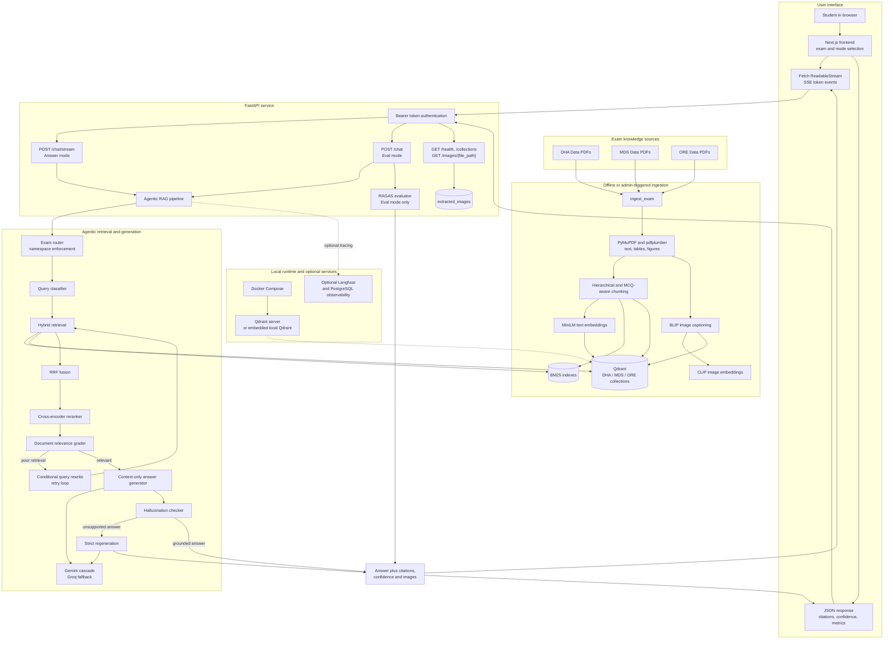

# MedBot

MedBot is a medical exam-focused Retrieval-Augmented Generation (RAG) system built for students preparing for DHA, MDS, and ORE exams.

It is designed to provide grounded, exam-standard answers from a curated medical knowledge base so that students do not have to paste textbooks or PDFs into ChatGPT for reliable responses.

## What MedBot solves

- Prevents exam content from being answered from generic internet knowledge alone.
- Provides answers grounded in the supplied PDF knowledge base.
- Reduces hallucinations by enforcing source-backed generation.
- Supports exam-specific context for DHA, MDS, and ORE standards.
- Includes hybrid retrieval for text and image content.

## Core architecture

### Stack

- Python backend: FastAPI
- Frontend: Next.js 14 with TypeScript
- Vector database: Qdrant (Docker or local embedded)
- Local retrieval models: sentence-transformers, cross-encoder, CLIP
- Cloud LLMs: Google Gemini cascade and Groq Llama fallback
- PDF processing: PyMuPDF and pdfplumber
- Search: dense embeddings + BM25 + CLIP image matching
- Deployment: optional Docker Compose and a Windows one-click launcher

### Why this stack

This stack was chosen for a blend of performance, flexibility, and reliability. FastAPI offers a lightweight Python API server with native async support for streaming SSE responses. Next.js with TypeScript makes it easy to build a modern chat UI that can consume both streaming and JSON endpoints while keeping frontend and API settings separate. Qdrant provides a production-grade vector store that supports hybrid search and can run either as a Docker service or as an embedded local instance when Docker is unavailable. Local embedding and reranking models keep retrieval fast and deterministic for exam-specific content, while cloud LLMs are used for generation to avoid requiring a large local chat model. PDF libraries are chosen for robust extraction of text and figures from study materials. Hybrid retrieval (dense + sparse + image) is used to reduce missed source citations and improve groundedness.

### Architecture pipeline



1. Knowledge ingestion
   - PDF files are read from the repository folders: `DHA Data`, `MDS Data`, `ORE Data`
   - Text is chunked into semantic and section-level passages
   - Figures and diagrams are extracted as image chunks
   - BM25 indexes are built for sparse retrieval
   - Dense embeddings are stored in Qdrant with metadata for citation

2. Retrieval
   - A user query is embedded with a local `sentence-transformers` model
   - Hybrid search uses:
     - dense vector similarity in Qdrant
     - BM25 sparse search
     - CLIP-based image retrieval for image-related queries
   - Reciprocal Rank Fusion (RRF) merges dense, sparse, and image results
   - A cross-encoder reranker sorts the final retrieved chunks by relevance

3. RAG orchestration
   - The query is classified into categories such as concept, MCQ, compare, image, recall, or general
   - Exam selection is enforced, so retrieval only uses the chosen exam namespace
   - If retrieval quality is poor, the question can be rewritten and retried
   - Retrieved chunks are graded for relevance before generation
   - The server generates answers using a strict context-only prompt
   - Hallucination checks and confidence scoring are applied before delivering the response

4. Response delivery
   - `answer` mode streams tokens through SSE for responsive chat UI
   - `eval` mode returns a complete JSON response with RAGAS evaluation metrics
   - Citations are returned with book name, chapter, page number, chunk type, and image paths

## Key mitigations for reliability

- **Exam namespace enforcement**: queries are limited to one exam dataset and cannot mix DHA, MDS, and ORE content.
- **Hybrid retrieval**: combined dense, sparse, and image search improves recall and grounding.
- **Document grading and query rewriting**: poor retrieval triggers a re-write and retry loop.
- **Strict generation prompt**: the LLM is instructed to answer only from provided context and cite sources.
- **Confidence scoring**: responses are labeled HIGH, MEDIUM, or LOW based on evidence support.
- **Smart ingestion**: the system skips re-indexing unchanged PDF datasets to avoid unnecessary work.
- **Token-based API auth**: all API requests require the shared `API_SECRET_TOKEN`.

## Repository structure

- `api/`: FastAPI application and endpoints
- `config/`: environment settings, model loading, Qdrant management, LLM integration
- `ingestion/`: PDF extraction, figure handling, chunking, and index building
- `rag/`: agentic pipeline orchestration
- `retrieval/`: hybrid retrieval implementation
- `frontend/`: Next.js UI for chat interactions
- `scripts/`: convenience scripts for ingestion, startup, and verification
- `DHA Data/`, `MDS Data/`, `ORE Data/`: exam PDF sources
- `qdrant_data/`, `models_cache/`, `bm25_indexes/`, `chunk_cache/`: runtime artifacts

## Environment variables

MedBot uses a project root `.env` file as the single source of truth.

Required values:

- `GOOGLE_API_KEY`: Google Cloud API key for Gemini model access
- `GROQ_API_KEY`: Groq API key for fallback LLM access
- `API_SECRET_TOKEN`: shared bearer token used by frontend and backend
- `HF_TOKEN`: Hugging Face token for local model downloads
- `NEXT_PUBLIC_API_URL`: frontend API URL, usually `http://localhost:8000`
- `NEXT_PUBLIC_API_TOKEN`: must match `API_SECRET_TOKEN`

Optional values:

- `QDRANT_MODE`: `auto`, `server`, or `local`
- `QDRANT_HOST` / `QDRANT_PORT`: Qdrant server address
- `LOCAL_MODEL_DEVICE`: `auto`, `cuda`, or `cpu`
- `USE_LOCAL_VISION_CAPTION`: `true` / `false`
- `VISION_CAPTION_MODEL`: model used for image captioning during ingest
- `LANGFUSE_PUBLIC_KEY`, `LANGFUSE_SECRET_KEY`, `LANGFUSE_HOST`: optional observability

## Getting API and model tokens

### Google Gemini API key

1. Create or use an existing Google Cloud project.
2. Enable the Vertex AI / Generative AI API.
3. Create an API key in the Google Cloud Console.
4. Set `GOOGLE_API_KEY` in `.env`.

### Groq API key

1. Sign up or log in at groq.ai or the Groq Cloud dashboard.
2. Create an API key for model access.
3. Set `GROQ_API_KEY` in `.env`.

### Hugging Face token

1. Create a Hugging Face account at `https://huggingface.co`.
2. Go to Settings > Access Tokens.
3. Create a token with `read` scope.
4. Set `HF_TOKEN` in `.env`.

### API secret token

- Generate a strong random string and assign it to `API_SECRET_TOKEN`.
- Use the same value for `NEXT_PUBLIC_API_TOKEN` so the frontend can authenticate requests.

## Setup and execution

### 1. Prepare the repository

From the repository root:

```powershell
python -m venv .venv
.\.venv\Scripts\activate
pip install -r requirements.txt
```

### 2. Prepare `.env`

Copy `env.examples` to `.env` and fill in the required keys.

### 3. Start Qdrant

If Docker is available:

```powershell
docker compose up qdrant -d
```

If Docker is not available, MedBot can use embedded local Qdrant storage with `QDRANT_MODE=local`.

### 4. Ingest or update knowledge base

Use smart ingestion to process PDFs only when the source data changes:

```powershell
python scripts\smart_ingest.py
```

To force a full re-ingest:

```powershell
python scripts\smart_ingest.py --force
```

### 5. Warm up local models

```powershell
python scripts\warmup_models.py
```

### 6. Launch the backend API

```powershell
python run.py
```

### 7. Launch the frontend

```powershell
cd frontend
npm install
npm run dev
```

### 8. One-click startup (Windows)

If you prefer automation, use the startup launcher:

```powershell
start_medrag.bat
```

This script creates the virtual environment, installs dependencies, starts Qdrant, ingests PDFs, warms up models, and opens the backend and frontend.

## API endpoints

- `POST /chat/stream`: streaming SSE chat response for answer mode
- `POST /chat`: full JSON chat response for eval mode
- `POST /ingest`: admin ingestion trigger for a single exam
- `GET /health`: health check
- `GET /collections`: Qdrant collection statistics

### Authentication

All protected endpoints require an `Authorization: Bearer {API_SECRET_TOKEN}` header.

## Frontend notes

The frontend reads `NEXT_PUBLIC_API_URL` and `NEXT_PUBLIC_API_TOKEN` from `frontend/.env.local`.

The React UI is built to:

- select exam mode (DHA, MDS, ORE)
- choose answer or eval mode
- support streaming responses
- display citations and confidence scores
- show retrieved images when available

## Troubleshooting

- If the backend raises `Missing .env`, copy `env.examples` to `.env`.
- If Qdrant is unreachable, set `QDRANT_MODE=local` or confirm Docker is running.
- If local models fail to load, ensure the Python environment has the correct CUDA-compatible PyTorch wheel or use `LOCAL_MODEL_DEVICE=cpu`.
- If the frontend cannot authenticate, verify `NEXT_PUBLIC_API_TOKEN` matches `API_SECRET_TOKEN`.

## Recommended workflow

1. Set exam to the desired target: DHA, MDS, or ORE.
2. Ask questions using official exam terminology.
3. Prefer answer mode for fast streaming replies.
4. Use eval mode when you want faithfulness and relevance metrics.
5. Rerun `python scripts\smart_ingest.py` after adding or changing PDF files.

## License and usage

This repository contains a medical exam study assistant and should be used with your own dataset of PDF study materials. Keep your API keys private and do not share `.env` publicly.
